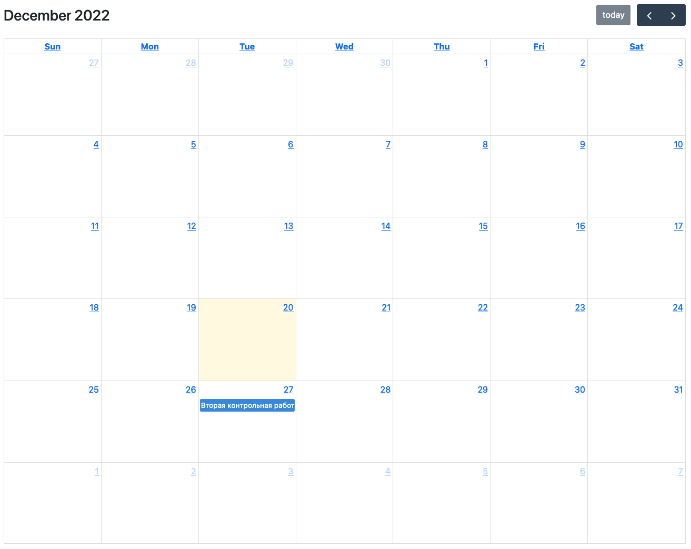

# Работа с готовыми решениями

В этой демке разбираемся как подключить следующие готовые модули: 

1) [FullCalendar](https://fullcalendar.io/)

## FullCalendar

FullCalendar - это удобный плагин для отображения полностраничных календарей. Пример такого календаря:



### Установка зависимостей

Для начала надо установить все зависимости:

```bash
$ npm i -S @fullcalendar/core @fullcalendar/vue3 @fullcalendar/daygrid @fullcalendar/interaction
```

### Настройка и подключение модуля

В директории `src/components` создайте файл `FullCalendar.vue` со следующим содержимым:

```vue
<template>
  <full-calendar />
</template>

<script>
import FullCalendar from '@fullcalendar/vue3'
import dayGridPlugin from '@fullcalendar/daygrid'
import interactionPlugin from '@fullcalendar/interaction'

export default {
  components: {
    FullCalendar
  }
}
</script>
```

Теперь надо добавить `props`, в которых мы передадим свойства календаря, основываясь на документации они могут выглядеть как-то так:

```js
calendarOptions: {
  plugins: [ dayGridPlugin, interactionPlugin ],
  initialView: 'dayGridMonth'
}
```

Давайте заведём константу `DEFAULT_OPTIONS`, чтобы не задавать эти параметры каждый раз:

```vue
<template>
  <full-calendar :options="calendarOptions" />
</template>

<script>
import FullCalendar from '@fullcalendar/vue3'
import dayGridPlugin from '@fullcalendar/daygrid'
import interactionPlugin from '@fullcalendar/interaction'

const DEFAULT_OPTIONS = {
  plugins: [ dayGridPlugin, interactionPlugin ],
  initialView: 'dayGridMonth'
}

export default {
  components: {
    FullCalendar
  },

  computed: {
    calendarOptions() {
      return DEFAULT_OPTIONS
    }
  }
}
</script>
```

Теперь, чтобы мы могли влиять на эти свойства заведём объект props, в котором опишем, что мы хотим принимать и зададим дефолтные значения, а вычисляемое свойство calendarOptions немного изменим, чтобы наши дефолтные значения могли быть дополнены или переписаны входящими параметрами:

```vue
<template>
  <full-calendar :options="calendarOptions" />
</template>

<script>
import FullCalendar from '@fullcalendar/vue3'
import dayGridPlugin from '@fullcalendar/daygrid'
import interactionPlugin from '@fullcalendar/interaction'

const DEFAULT_OPTIONS = {
  plugins: [ dayGridPlugin, interactionPlugin ],
  initialView: 'dayGridMonth',
  editable: true
}

export default {
  components: {
    FullCalendar
  },

  props: {
    options: {
      type: Object,
      default: DEFAULT_OPTIONS
    }
  },

  computed: {
    calendarOptions() {
      return { ...DEFAULT_OPTIONS, ...this.options }
    }
  }
}
</script>
```

Теперь наш компонент можно использовать в представлениях следующим образом:

```vue
<full-calendar
  :options="{
    events: calendarEvents,
    eventChange: handleEventChange,
    dateClick: handleDateClick
  }"
/>
```

В `events` мы будем передавать события, которые хотим отрисовать на календаре, а `eventChange` и `dateClick` - это коллбэки (функции обратного вызова), которые позволяют отслеживать события, совершаемые пользователем и каким-то образом их обрабатывать.

### Интеграция с JSON-сервером

Основы работы с JSON-сервером уже ранее разбирались и доступны в этих видео:

- [Тестирование фронтенда, иммитация внешнего API, JSON-сервер](https://www.youtube.com/watch?v=_3YLqewhII0)
- [Настраиваем JSON-сервер с авторизацией на примере приложения для ведения заметок](https://www.youtube.com/watch?v=_yvw_tAUGZw)

#### Подготавливаем данные

Сначала заведём в `db.json` коллекцию calendarEvents следующего вида:

```json
"calendarEvents": [
  { "id": 1, "title": "Дедлайн защиты третьей лабораторной", "date": "2023-01-13" },
  { "id": 2, "title": "Вторая контрольная работа", "date": "2022-12-27" }
]
```

Теперь по адресу http://localhost:3000/calendarEvents будут доступны события для отображения в календаре.

#### Настраиваем взаимодействие с API

Для начала в `src/api` заведём новый файл `calendarEvents.js`:

```js
class CalendarEventsApi {
  constructor(instance) {
    this.API = instance
  }

  getAll = async () => {
    return this.API({
      url: '/calendarEvents'
    })
  }
}

export default CalendarEventsApi
```

Теперь заведём хранилище `calendarEvents.js` в директории `src/stores`:

```js
import { defineStore } from 'pinia'
import { calendarEventsApi } from '@/api'

const useCalendarEventsStore = defineStore('calendarEvents', {
  state: () => ({
    calendarEvents: []
  }),

  actions: {
    async loadCalendarEvents() {
      const response = await calendarEventsApi.getAll()

      this.calendarEvents = response.data

      return response
    }
  }
})

export default useCalendarEventsStore
```

На этом интеграция с API завершена, можно создавать отдельное представление и подключать методы из хранилища.

### Выводим данные в календарь

В директории `src/views` создайте файл `CalendarPage.vue`:

```vue
<template>
  <base-layout>
    <h1>Event calendar</h1>

    <full-calendar
      :options="{
        events: calendarEvents,
        eventChange: handleEventChange,
        dateClick: handleDateClick
      }"
    />
  </base-layout>
</template>

<script>
import { mapActions, mapState } from 'pinia'

import useCalendarEventsStore from '@/stores/calendarEvents'


import BaseLayout from '@/layouts/BaseLayout.vue'
import FullCalendar from '@/components/FullCalendar.vue'

export default {
  name: 'CalendarPage',

  components: { BaseLayout, FullCalendar },

  computed: {
    ...mapState(useCalendarEventsStore, ['calendarEvents'])
  },

  methods: {
    ...mapActions(useCalendarEventsStore, ['loadCalendarEvents']),

    handleEventChange(payload) {
      console.log('event change', payload)
    },

    handleDateClick(payload) {
      console.log('date clicked', payload)
    }
  },

  mounted() {
    this.loadCalendarEvents()
  }
}
</script>
```

Здесь мы подключаем методы из хранилища для подгрузки событий и передаём их в компонент `FullCalendar`. Также написана начальная обработка событий `handleEventChange` и `handleDateClick`. Чтобы эти события работали надо передать в календарь дополнительное свойство `editable` со значением `true`. Для примера я решил занести его в константу `DEFAULT_OPTIONS`:

```vue
<template>
  <full-calendar :options="calendarOptions" />
</template>

<script>
import FullCalendar from '@fullcalendar/vue3'
import dayGridPlugin from '@fullcalendar/daygrid'
import interactionPlugin from '@fullcalendar/interaction'

const DEFAULT_OPTIONS = {
  plugins: [ dayGridPlugin, interactionPlugin ],
  initialView: 'dayGridMonth',
  editable: true
}

export default {
  components: {
    FullCalendar
  },

  props: {
    options: {
      type: Object,
      default: DEFAULT_OPTIONS
    }
  },

  computed: {
    calendarOptions() {
      return { ...DEFAULT_OPTIONS, ...this.options }
    }
  }
}
</script>

<style>
.fc-day {
  cursor: pointer;
}
</style>
```

Также добавилась секция `style`, в которой мы принудительно для всех ячеек с датами ставим свойство `cursor` со значением `pointer`, чтобы показать пользователю, что такая ячейка является кликабельной.
