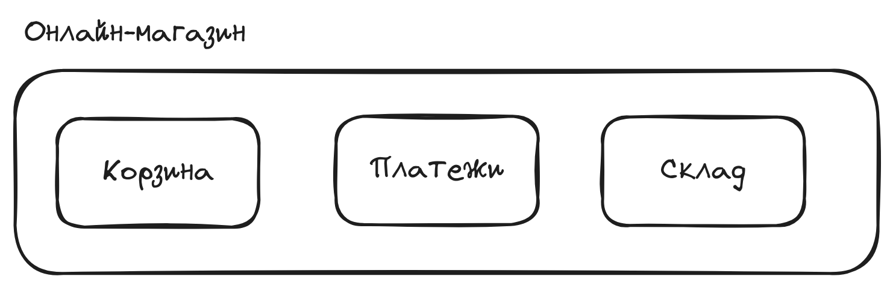
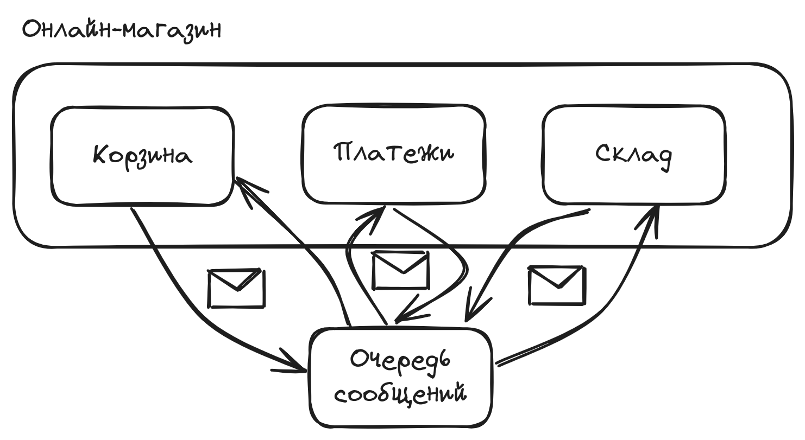

# Пример взаимодействия микросервисов через RabbitMQ

Требования:

- docker (не ниже версии 25.0.3),
- node (не ниже версии 20),
- npm (не ниже версии 10).

## Какие есть сервисы

- cart.ts - сервис корзины
- payment.ts - сервис платежей
- stock.ts - сервис склада



## Взаимодействие сервисов между собой



1) Сервис корзины получает POST-запрос с телом корзины, например:

```json
{
    "items": [
        {
            "id": 1,
            "amount": 2,
            "total_price": 200
        }
    ]
}
```

2) Сервис корзины оповещает очередь `cart` о получении информации о корзине

3) Сервис платежей получает сообщение из очереди `cart`, подтверждает оплату

4) Сервис платежей оповещает очередь сервиса склада `stock`

5) Сервис склада получает сообщение о покупке из очереди `stock`, меняет количество оставшихся товаров

## Как запустить

Для начала нужно стартануть RabbitMQ, он положен в docker:

```bash
docker compose up
```

Теперь RabbitMQ запущен на порте 5672.

Теперь нужно установить зависимости:

```bash
npm i
```

Запуск самих сервисов (в отдельных терминалах, разумеется):

```bash
npx ts-node cart.ts
```

```bash
npx ts-node stock.ts
```

```bash
npx ts-node payment.ts
```

